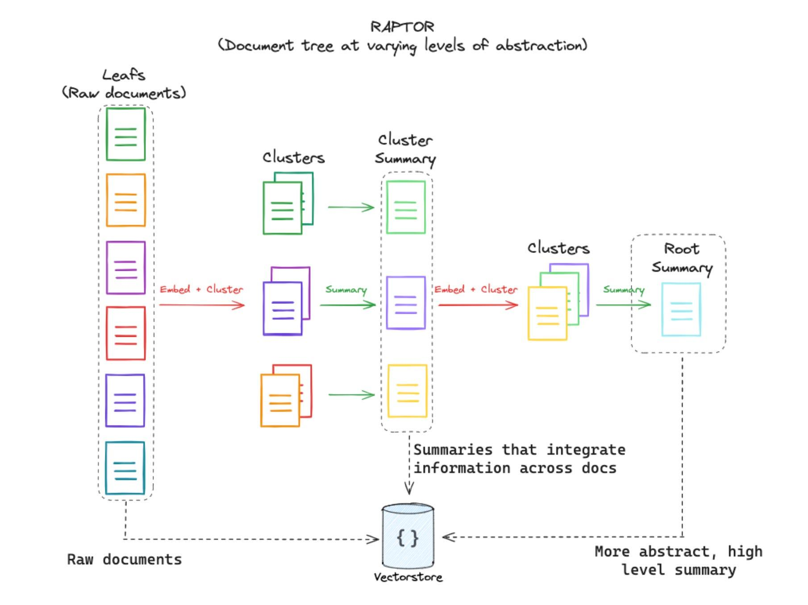
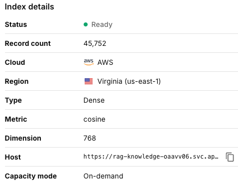
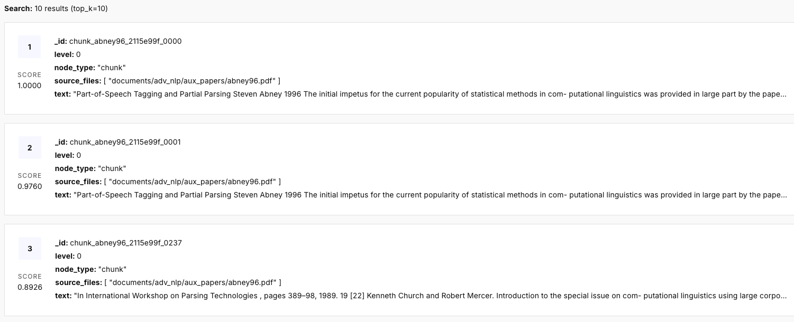

#+TITLE: RAG Knowledge Assistant
#+OPTIONS: toc:nil num:nil ^:nil
#+STARTUP: showall

* Abstract
Retrieval-Augmented Generation (RAG) systems address a major challenge in modern organizations: valuable knowledge is often buried across large collections of documents, making information difficult to retrieve efficiently. This project presents the development of a domain-specific RAG Knowledge Assistant designed to answer natural language questions using an organization’s internal document corpus while ensuring responses remain grounded in source material. The system combines vector-based retrieval with large language model generation to provide accurate, traceable, and context-aware answers. Inspired by the RAG, RAPTOR, and Self-RAG research frameworks, the architecture incorporates hierarchical indexing, relevance grading, and hallucination detection to improve retrieval quality and response reliability. Pinecone was used as the vector database, while LangChain and [[https://github.com/Nafeek30/rag_project/blob/main/api/main.py#L54-L70][LangGraph]] managed the retrieval and inference pipeline. In addition to the core retrieval and generation pipeline, we added an evaluation-oriented debugging interface and API endpoint that expose internal RAG trace data including route decisions, retrieved document identifiers, per-document relevance grades, and grounding judgments. This enables more rigorous comparison of model performance across providers including Groq, Claude, Grok, Qwen, and OpenAI. The project demonstrates the practical potential of Self-Reflective RAG systems for enterprise knowledge management and domain-specific AI applications.

* Introduction
Organizations today face a growing challenge in managing and accessing large volumes of information. Documents such as research papers, policies, reports, contracts, and technical materials accumulate rapidly, often faster than they can be properly organized. As a result, critical knowledge becomes difficult to locate, leading to wasted time, inconsistent decision-making, and reduced organizational efficiency. Although the required information may exist somewhere within a company’s document repository, employees frequently struggle to identify the correct source or retrieve it quickly.

To address this problem, this project proposes a Retrieval-Augmented Generation (RAG) Knowledge Assistant capable of answering natural language questions using an organization’s own documents as the primary knowledge source. Unlike traditional language models that may generate unsupported or hallucinated responses, the proposed system grounds its answers directly in retrieved document content and provides traceable citations to the original source chunks. This improves both reliability and transparency.

The project builds upon foundational research in RAG architectures, including the original RAG framework, RAPTOR’s hierarchical retrieval strategy, and Self-RAG’s self-reflection mechanisms for relevance and hallucination checking. Using these concepts, the system integrates vector embeddings, Pinecone vector storage, LangChain orchestration, and self-critique pipelines to create a more reliable and domain-aware question-answering assistant.

A large challenge in RAG is that the quality of the final answer alone does not indicate where the failure occurred in the system. A low quality answer could result from weak retrieval, irrelevant retrieved context, unsupported generation, model-specific behavior, etc. To address this visibility issue, we extended the system with a [[https://github.com/Nafeek30/rag_project/blob/main/api/api.py#L96-L100][debug trace API]] and [[https://github.com/Nafeek30/rag_project/blob/main/web_app/index.py#L208-L326][UI metrics view]] that expose intermediate pipeline decisions. This allows us to evaluate the system with not only the final answer, but also by retrieval quality, relevance grading, grounding, latency and model behavior across providers.

* Related Work
Our system builds on three major research works in Retrieval-Augmented Generation (RAG). The first is the original RAG framework proposed by Lewis et al. [1], which introduced the retrieve-then-generate architecture for knowledge-intensive NLP tasks. This work established the foundation for grounding large language model outputs using external document retrieval rather than relying entirely on model memory.

The second major influence is RAPTOR by Sarth et al. [2], which addressed limitations of flat chunk retrieval in traditional RAG systems. RAPTOR organizes documents into hierarchical tree structures through recursive clustering and summarization, enabling retrieval at multiple levels of abstraction. Our [[https://github.com/Nafeek30/rag_project/blob/main/indexing/index.py#L1-L17][indexing pipeline]] was inspired by this hierarchical retrieval approach for improving contextual retrieval quality.

The third key work is Self-RAG by Asai et al. [3], which introduced self-reflection mechanisms allowing models to evaluate retrieval relevance and generation grounding during inference. Concepts from Self-RAG directly influenced our relevance grading and hallucination-checking components, which act as validation stages before returning final responses.

Together, these works provided the conceptual foundation for our grounded, traceable, and self-reflective RAG knowledge assistant.

“

* Methodology
I. *Indexing:* Before any embedding can take place, each document is split into overlapping token-level chunks. We settled on a chunk size of 100 tokens with a 20-token overlap between consecutive chunks. The overlap is not incidental, it is a deliberate mechanism to prevent semantic content from being severed cleanly at chunk boundaries. When a sentence or argument spans the end of one chunk and the beginning of the next, the overlapping region ensures that both chunks carry enough context to be retrieved usefully in isolation. At 100 tokens, each chunk is specific enough to answer a precise question but long enough to contain coherent meaning; the overlap softens the hard cut that pure non-overlapping chunking would impose.

Once the documents are chunked, the flat list of passages is not stored directly. Instead, we implemented a RAPTOR-inspired [[https://github.com/Nafeek30/rag_project/blob/main/indexing/index.py#L453-L539][recursive tree-building process]] that organises chunks into a multi-level hierarchy. The process begins at the leaf level: the raw 100-token chunks form the lowest and most granular tier of the tree. These leaf chunks are then grouped by semantic similarity into clusters, and each cluster is passed to [[https://github.com/Nafeek30/rag_project/blob/main/indexing/index.py#L79-L157][Qwen 2.5-1.5B-Instruct]] (a lightweight open-source language model) which produces a single abstract summary of the cluster's content ([[https://github.com/tonikazic/s26nlp/tree/main/indexing][s26nlp indexing directory]]). That summary becomes a new node one level above the leaves. The process is then applied recursively: the summaries are themselves clustered and re-summarised to produce even more abstract nodes, until the full hierarchy converges. The result is a tree whose leaves contain precise, granular passages and whose upper nodes contain progressively broader summaries that aggregate the content of many documents.

#+CAPTION: Figure 1. RAPTOR paper indexing method [4]
#+ATTR_ORG: :width 700
#+ATTR_HTML: :width 700px

This structure gives the retrieval system a meaningful range of granularity to operate over. A highly specific factual query will find its best match in a leaf chunk. A broad conceptual question is for example, what a large body of course material says about attention mechanisms in general, can match a higher-level summary node that no single leaf chunk could satisfy. The RAPTOR approach therefore substantially extends the retrieval system's effective scope beyond what flat chunking alone could achieve.

Each node in the tree is converted into a dense vector using [[https://github.com/Nafeek30/rag_project/blob/main/indexing/index.py#L167-L182][nomic-embed-text-v1.5]] ([[https://github.com/tonikazic/s26nlp/tree/main/indexing][s26nlp indexing directory]]). This model is a modern open-source embedding model that produces 768-dimensional representations competitive with proprietary alternatives, with strong support for long-context inputs. The choice of this model for the offline indexing pass reflects a deliberate trade-off: [[https://github.com/Nafeek30/rag_project/blob/main/indexing/index.py#L167-L182][nomic-embed-text-v1.5]] is a heavier model than what would be practical to run in real time at query time, but because indexing is a one-time offline operation, the additional computational cost is acceptable in exchange for richer vector representations in the stored knowledge base.

The pipeline's final output is a JSON file containing, for every node in the tree, the embedding vector and a metadata record capturing the source document path, chunk index, token range, and tree level. The metadata is what makes every retrieved result citable; when the system returns a passage, it can point to exactly which source document and which segment of that document the passage came from. The JSON is formatted to match [[https://github.com/Nafeek30/rag_project/blob/main/indexing/index.py#L542-L560][Pinecone's upsert specification]] precisely, enabling direct import into the vector database without a separate transformation step.

II. *Database:* The 45,752 vectors produced by the [[https://github.com/Nafeek30/rag_project/blob/main/indexing/index.py#L1-L17][indexing pipeline]] could be stored in any database, but the access pattern of RAG retrieval (given a query vector, return the k most similar stored vectors) is not one for which general-purpose relational or document databases are designed. A naive implementation would require computing the distance between the query vector and every stored vector on every request, a cost that grows linearly with the corpus and quickly becomes prohibitive. Pinecone is a managed vector database built specifically to serve approximate-nearest-neighbour (ANN) queries efficiently: its internal index structures permit sub-linear search, returning the top-k matches in milliseconds regardless of whether the corpus contains thousands or millions of vectors.

#+CAPTION: Figure 2. Vector embeddings stored in Pinecone.
#+ATTR_ORG: :width 700
#+ATTR_HTML: :width 700px

Pinecone also removes the operational burden of running and maintaining an indexing server. Sharding, replication, and query serving are handled by the managed service, allowing the team to concentrate engineering effort on the retrieval and generation logic rather than on database administration.

A crucial detail of the system's architecture is that it uses two different embedding models at two different stages of the pipeline. During the offline indexing pass, [[https://github.com/Nafeek30/rag_project/blob/main/indexing/index.py#L167-L182][nomic-embed-text-v1.5]] embeds the documents into the stored vectors. At query time, however, the user's query is embedded using all-MiniLM-L6-v2, a much smaller and faster HuggingFace model that can run locally on the inference server within the latency budget of an interactive request. The presentation notes explicitly that Pinecone retrieval always uses HuggingFace embeddings, making all-MiniLM-L6-v2 the consistent runtime embedding choice regardless of which language model is selected for generation.

This split introduces a constraint that the team validated carefully: for cosine similarity to be a meaningful measure of semantic proximity, the stored vectors and the query vectors must inhabit compatible vector spaces. Two models trained on different objectives with different architectures will generally produce incompatible spaces, so the choice of models is not arbitrary. The team confirmed that both models produce representations aligned well enough for effective retrieval across the full 45,752-vector corpus, a validation step that is easy to overlook but critical to the system's correctness.

The domain-specific knowledge base was built by Parthaw using sentence-transformers to produce embeddings and Pinecone's Python client to manage vector storage and retrieval. Each record upserted into Pinecone takes the form of a tuple containing a unique identifier, the embedding vector, and the metadata dictionary produced during indexing ([[https://github.com/Nafeek30/rag_project/tree/knowledge_base_creation][knowledge_base_creation branch]]). Once the full 45,752-vector corpus was loaded, Parthaw validated retrieval quality by running representative queries and inspecting whether the returned chunks were genuinely relevant to the questions asked; manual ground-truth evaluation that confirmed the index was functioning correctly before the system was integrated with the generation pipeline.

When a user submits a query, the inference pipeline encodes the query string into a vector using all-MiniLM-L6-v2, then sends that vector to [[https://github.com/Nafeek30/rag_project/blob/main/api/nodes.py#L160-L208][Pinecone's query API]] requesting the top-k most similar stored vectors. Pinecone returns the matching chunks along with their cosine similarity scores and associated metadata. Cosine similarity measures the angle between two vectors in high-dimensional space: a score of 1.0 indicates perfect semantic alignment, while a score approaching 0 indicates orthogonality and semantic unrelatedness. By ranking retrieved chunks according to their cosine similarity to the query, the system surfaces passages that are most semantically proximate to what the user is asking, irrespective of whether the exact query words appear in the document, a property that pure keyword search cannot provide.

#+CAPTION: Figure 3. Example of query retrieval sequences.
#+ATTR_ORG: :width 700
#+ATTR_HTML: :width 700px

III. *Self-RAG*

The project implements the Self-RAG framework using a multi-step, self-evaluating workflow. Traditional retrieval models often fail opaquely because they lack mechanisms to isolate where an error occurred. To resolve this, the architecture utilizes [[https://github.com/Nafeek30/rag_project/blob/main/api/main.py#L54-L70][LangGraph]] to model the execution as a directed state graph. Each discrete node reads and writes to a shared [[https://github.com/Nafeek30/rag_project/blob/main/api/state.py#L5-L29][GraphState TypedDict]], which persists the query, retrieved documents, generation attempts, and execution traces across the request lifecycle.

** [[https://github.com/Nafeek30/rag_project/blob/main/api/nodes.py#L347-L360][Routing]]
General language models waste computational resources when retrieving context for conversational queries. A routing node classifies incoming questions to prevent this inefficiency. A language model evaluates the prompt and returns a structured output dictating whether the query requires external knowledge. If retrieval is unnecessary, the workflow bypasses the database entirely and generates a direct response.

** [[https://github.com/Nafeek30/rag_project/blob/main/api/nodes.py#L160-L315][Retrieval and Relevance Grading]]
Vector similarity alone does not guarantee semantic relevance. Upon routing to the retrieval node, the application fetches the five most similar document chunks from Pinecone using [[https://github.com/Nafeek30/rag_project/blob/main/indexing/index.py#L167-L182][nomic-embed-text-v1.5]] embeddings. To ensure quality, a dedicated grading node evaluates these retrieved chunks independently. Instead of relying on free-form text, this node enforces a structured output to reliably extract a boolean relevance score and a documented justification for each chunk. If the grader determines that no retrieved chunks contain applicable evidence, the logic safely routes to an out-of-scope fallback node rather than forcing a hallucinated response.

** [[https://github.com/Nafeek30/rag_project/blob/main/api/nodes.py#L217-L344][Answer Generation and Hallucination Checking]]
Language models are prone to unsupported extrapolations even when provided with explicit context. The generation node synthesizes a final response using only the approved contextual blocks. To mitigate the risk of the model drifting beyond the provided evidence, the output passes through a hallucination checker. This node acts as an internal auditor by comparing the generated text against the retrieved documents. It utilizes structured outputs to strictly categorize contradictions or unsupported claims. If a hallucination is detected, the workflow triggers a self-correction loop and regenerates the answer up to a strict limit of two attempts before returning the safest available response.

** [[https://github.com/Nafeek30/rag_project/blob/main/api/llm_config.py#L21-L76][Multi-Model Support]]
Hardcoding model dependencies restricts flexibility and makes comparative evaluation difficult. To enable seamless provider switching, the architecture abstracts model instantiation into a centralized factory function. This isolates the choice of language model from the underlying [[https://github.com/Nafeek30/rag_project/blob/main/api/main.py#L54-L70][LangGraph]] logic, prompt engineering, and structured output parsing. All integrated models operate at a fixed temperature of zero to ensure deterministic reasoning across the routing, grading, and generation nodes.

- *[[https://github.com/Nafeek30/rag_project/blob/main/api/llm_config.py#L38-L46][Groq (Llama 3.1 8B)]]:* Serves as the high-speed default for interactive queries via cloud inference. It leverages a strict JSON mode parameter for the routing, grading, and checking stages.
- *[[https://github.com/Nafeek30/rag_project/blob/main/api/llm_config.py#L25-L30][Anthropic Claude Sonnet 4.6]]:* Provides advanced reasoning capabilities. Format instructions are embedded directly into the prompt text, bypassing the need for explicit JSON mode parameters.
- *[[https://github.com/Nafeek30/rag_project/blob/main/api/llm_config.py#L48-L58][xAI Grok 3 Mini]]:* Accessed via an OpenAI-compatible interface. This allows the reuse of standard client libraries while directing traffic to xAI infrastructure.
- *[[https://github.com/Nafeek30/rag_project/blob/main/api/llm_config.py#L32-L36][OpenAI GPT-4o Mini]]:* Offers a reliable commercial baseline utilizing native JSON response formatting.
- *[[https://github.com/Nafeek30/rag_project/blob/main/api/llm_config.py#L60-L70][Qwen3 4B (Local Inference via Ollama)]]:* Facilitates completely offline execution while leveraging the native chain-of-thought reasoning mode of the model. A custom text processor dynamically appends directives to the query text to enable or disable thinking. It also automatically strips <think> tags from the final output to ensure clean JSON parsing.

IV. *UI*

The graphical user interface for the SELF-RAG knowledge assistant was built using [[https://github.com/Nafeek30/rag_project/blob/main/web_app/index.py#L334-L590][Streamlit]], a Python framework that enables rapid development of data-focused web applications without requiring a separate frontend codebase. The interface communicates with a FastAPI backend over HTTP, sending user queries to either the [[https://github.com/Nafeek30/rag_project/blob/main/api/api.py#L89-L93][/ask]] or [[https://github.com/Nafeek30/rag_project/blob/main/api/api.py#L96-L100][/ask_debug]] endpoint and rendering the structured JSON response in real time.

The layout is organised into a sidebar and a main content area. The sidebar serves as the primary control panel, where the user can select which language model to use for a given session. Five models are available: [[https://github.com/Nafeek30/rag_project/blob/main/api/llm_config.py#L38-L46][Groq (Llama 3.1 8B)]], Claude (Anthropic Sonnet 4.6), Grok ([[https://github.com/Nafeek30/rag_project/blob/main/api/llm_config.py#L48-L58][xAI Grok 3 Mini]]), [[https://github.com/Nafeek30/rag_project/blob/main/api/llm_config.py#L60-L70][Qwen3 4B running locally via Ollama]], and [[https://github.com/Nafeek30/rag_project/blob/main/api/llm_config.py#L32-L36][OpenAI GPT-4o Mini]]. Each model is labelled with a colour-coded identifier and a badge indicating whether inference occurs in the cloud or on local hardware. When the Qwen3 model is selected, an additional toggle appears in the sidebar that allows the user to enable or disable its extended chain-of-thought reasoning mode. When thinking is enabled, a [[https://github.com/Nafeek30/rag_project/blob/main/api/nodes.py#L61-L67][/think]] prefix is prepended to the question before it reaches the model, instructing it to reason step by step before producing its final answer. When disabled, a [[https://github.com/Nafeek30/rag_project/blob/main/api/nodes.py#L61-L67][/no_think]] prefix is used instead, yielding faster responses with no intermediate reasoning.

Below the model selector, the sidebar displays a live session dashboard. This panel tracks the total number of queries submitted in the current session, the proportion of those queries that were answered using the knowledge base rather than general model knowledge, a breakdown of how often each model was used, and the average response time across all queries. Beneath the session statistics, a [[https://github.com/Nafeek30/rag_project/blob/main/web_app/index.py#L120-L185][word cloud]] is rendered after each successful query. The [[https://github.com/Nafeek30/rag_project/blob/main/web_app/index.py#L120-L185][word cloud]] is generated from the text of all responses produced so far in the session, giving a visual summary of the topics the assistant has discussed. Larger words indicate terms that appear more frequently across the accumulated answers.

The main content area is divided into two tabs. The first tab contains the conversational interface. When a user submits a question, the interface immediately displays a spinner to indicate that the backend is processing the request. Once a response is received, the answer is rendered word by word to simulate a streaming experience, which makes the application feel more responsive and reduces the perception of latency. Each response is accompanied by a badge indicating whether the answer originated from the knowledge base or was produced from the model's general parametric knowledge. When the knowledge base was consulted, an [[https://github.com/Nafeek30/rag_project/blob/main/web_app/index.py#L315-L326][expandable sources panel]] is shown beneath the answer. Each source entry displays the document rank, a short text snippet from the retrieved chunk, the originating file or paper title, and the similarity score returned by the vector store. If the pipeline determined that no retrieved document was sufficiently relevant to the question, the system routes to an out-of-scope handler that tells the user which topics are covered in the knowledge base and, where possible, offers a short answer drawn from general knowledge clearly labelled as such.

The interface also exposes an optional [[https://github.com/Nafeek30/rag_project/blob/main/web_app/index.py#L208-L326][pipeline trace panel]]. When the metrics feature is enabled, the user can inspect the sequence of nodes the query passed through in the [[https://github.com/Nafeek30/rag_project/blob/main/api/main.py#L54-L70][LangGraph]] workflow, including the routing decision, retrieval, relevance grading, generation, and hallucination checking steps. Relevance grades are displayed for each retrieved document, showing whether the grader considered it pertinent to the question. Hallucination grades are shown alongside the grounding verdict from the hallucination checker.

The second tab presents a three-dimensional visualisation of the vector space underlying the knowledge base. At application startup, a [[https://github.com/Nafeek30/rag_project/blob/main/scripts/build_vector_cache.py#L1-L81][precomputed cache file]] is loaded from disk. This cache was built by sampling approximately 4,500 document chunks from the 45,000 vectors stored in Pinecone, fitting a [[https://github.com/Nafeek30/rag_project/blob/main/scripts/build_vector_cache.py#L58-L63][Principal Component Analysis]] model to reduce the 768-dimensional embedding space to three dimensions, and applying [[https://github.com/Nafeek30/rag_project/blob/main/scripts/build_vector_cache.py#L65-L68][KMeans clustering]] with six clusters to group semantically similar chunks. The resulting three-dimensional coordinates, cluster labels, source labels, and PCA transformation parameters are stored in a compressed NumPy archive of around 626 kilobytes.

When the user submits a query and a query embedding is returned by the backend alongside the answer, the interface projects this embedding into the same three-dimensional space using the saved PCA mean vector and component matrix. The projected query point is displayed as a gold star in the scatter plot. The five cached chunks nearest to the query point, as measured by Euclidean distance in the reduced space, are highlighted as red diamonds, and thin lines connect the query point to each of them to make the neighbourhood relationship visually explicit. All remaining chunks are coloured according to their cluster assignment. Hovering over any point in the scatter plot reveals the source document label and a short excerpt from the chunk text. This visualisation gives the user an intuitive understanding of where their question sits relative to the knowledge base and which chunks the retrieval step is likely to consider most relevant.

V. *Evaluation and Debug Tracing*

To support systematic evaluation, we added a debug API endpoint, [[https://github.com/Nafeek30/rag_project/blob/main/api/api.py#L96-L100][/ask_debug]], alongside the original [[https://github.com/Nafeek30/rag_project/blob/main/api/api.py#L89-L93][/ask]] endpoint. The original endpoint preserves the production-style user response, while [[https://github.com/Nafeek30/rag_project/blob/main/api/api.py#L96-L100][/ask_debug]] returns a richer trace of the internal RAG pipeline. This separation avoids adding unnecessary overhead to normal usage while making detailed evaluation data available when needed.

The debug trace records the route decision, retrieved document IDs, retrieval scores, per-document relevance grades, relevant document indices, generation attempts, prompt context, and hallucination/grounding results. Each node in the [[https://github.com/Nafeek30/rag_project/blob/main/api/main.py#L54-L70][LangGraph]] pipeline appends structured metadata to a shared trace object. As a result, each response can be inspected step by step. This shows whether retrieval was used, which chunks were retrieved, whether each chunk was relevant, how many attempts were required, and whether the final answer was grounded in the retrieved evidence.

This instrumentation is important because final answer quality alone does not identify the source of failure. A poor response may come from several different failure modes, such as the router incorrectly skipping retrieval, the retriever returning weak or irrelevant chunks, the generator ignoring useful evidence, or the final answer containing claims that are unsupported by the retrieved context. By exposing the intermediate state, the debug trace allows these cases to be distinguished rather than collapsed into a single notion of “bad answer.”

We also modified relevance grading so that every retrieved chunk is evaluated independently rather than grading only the top-ranked chunk. Each retrieved document receives a rank, a binary relevant/not relevant label, and a short explanation for the decision. The system also stores the indices of chunks judged relevant. This provides a more accurate picture of retrieval quality because useful evidence may appear below the first result. For example, if the first chunk is only loosely related but the third chunk directly answers the question, the updated relevance trace captures that distinction.

Finally, we updated the hallucination check to compare the generated answer against all retrieved documents. Earlier grounding checks considered only the first retrieved chunk, even though answer generation used the full retrieved context. This mismatch could incorrectly label an answer as hallucinated when its supporting evidence appeared in a lower-ranked chunk. The updated grounding check evaluates the answer against the same document set used for generation and returns a structured result containing whether the answer is grounded, unsupported claims, contradicted claims, and a brief explanation. This makes the grounding signal better aligned with the actual evidence available to the model during generation.

* Work Delegation
- Kazi Nafee: Developed the RAPTOR-inspired [[https://github.com/Nafeek30/rag_project/blob/main/indexing/index.py#L1-L17][indexing pipeline]], including recursive tokenization, clustering, summarization, and tree-structured document organization. He also contributed to prompt optimization and testing.
- Parthaw Goswami: Created the domain-specific knowledge base using sentence transformers and configured Pinecone for vector storage and retrieval. He also validated retrieval quality across the document corpus.
- Evan Schreiner: Developed the initial RAG pipeline and Self-RAG architecture. He implemented the FastAPI backend and integrated support for both local and cloud-based inference providers.
- Mahad Khaliq: Expanded multi-model integration support, contributed to the final user interface design, fixed bugs in the integration, developed the 3D vector space visualization system, and managed HPC deployment on the Hellbender cluster.
- Nick Allegretti: Implemented the transparency and debugging endpoint, hallucination detection logic, OpenAI integration support, original project user interface, work on the final UI and implemented project ORG file.

* Future Work
Several improvements can further enhance the scalability, accuracy, and adaptability of the RAG Knowledge Assistant.

- Develop precision prompting strategies tailored for different domains such as healthcare, academia, finance, and legal systems to improve contextual response quality.
- Implement HyDe-style retrieval enhancement methods that summarize and classify user queries before retrieval, enabling the system to dynamically apply specialized prompts and retrieval strategies.
- Expand automated testing and benchmarking pipelines to evaluate retrieval quality, grounding accuracy, hallucination detection, and latency across different model providers.

* Conclusion
This project demonstrated the development of a grounded and self-reflective Retrieval-Augmented Generation knowledge assistant capable of answering natural language questions using a domain-specific document corpus. By combining vector retrieval, hierarchical indexing, relevance grading, and hallucination checking, the system improves both the reliability and transparency of generated responses.

Overall, the project highlights the practical potential of Self-RAG architectures for enterprise knowledge management, technical research assistance, and future domain-specific AI applications.

* Code
Github link: [[https://github.com/Nafeek30/rag_project][https://github.com/tonikazic/s26nlp]]

* References
1. P. Lewis et al., “Retrieval-augmented generation for knowledge-intensive NLP tasks,” in Proc. 34th Conf. Neural Information Processing Systems (NeurIPS), 2020, pp. 9459–9474.
2. S. Sarth et al., “RAPTOR: Recursive abstractive processing for tree-organized retrieval,” arXiv preprint arXiv:2401.18059, 2024.
3.  A. Asai et al., “Self-RAG: Learning to retrieve, generate, and critique through self-reflection,” arXiv preprint arXiv:2310.11511, 2023.
4. A. Narayanamurthy, "Beyond RAG: Raptor for Long Context Retrieval," Eikos, Jun. 03, 2024. Available: [[https://eikos.substack.com/p/beyond-rag-raptor-for-long-context][Beyond RAG: Raptor for Long Context Retrieval]]. [Accessed: May 11, 2026].
